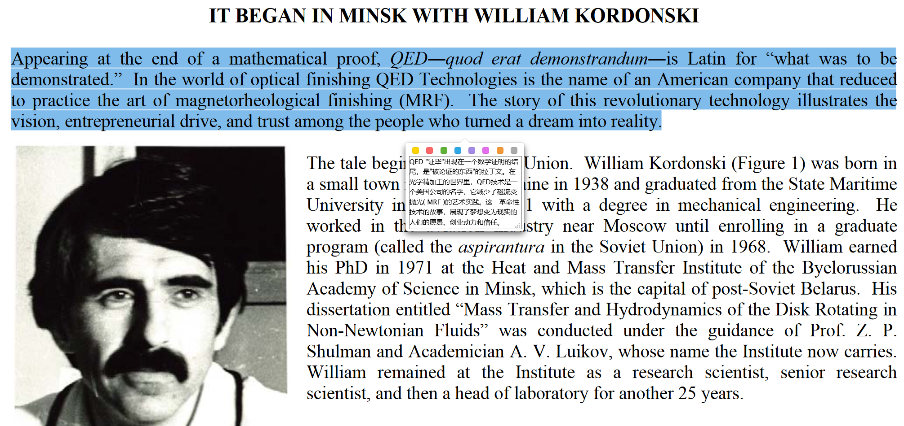

# P0-1 History of magnetorheological finishing

## William Kordonski

Luikov Institute of Heat and Mass Transfer in Minsk, Belarus（白俄罗斯明斯克路易科夫传热与传质研究所）

### 大致时间线

科尔东斯基带领团队在20世纪90年代发明了磁流变技术；1991年苏联解体后，纽约商人明茨受邀去Minsk研究技术转移；他被告知了MRF的潜力但是并不懂，所以去罗切斯特大学COM找哈维教授交流，交流决定派出雅各布教授评估MRF；1993年在雅各布的努力和明茨的资金支持下，科尔东斯基及其同事前往罗切斯特大学COM和雅各布以及格里尼一起工作；1994年一台预原型MRF精加工机器投入使用，其中佛波斯教授和达马斯博士开发了确定性控制算法；1996年，格里尼意识到了该技术的商业潜力，受明茨资金支持成立了QED()公司；1998年第一台商用MRF机器问世；2006年QED被Cabot微电子公司收购。

Mass Transfer and Hydrodynamics of the Disk Rotating in Non-Newtonian Fluids